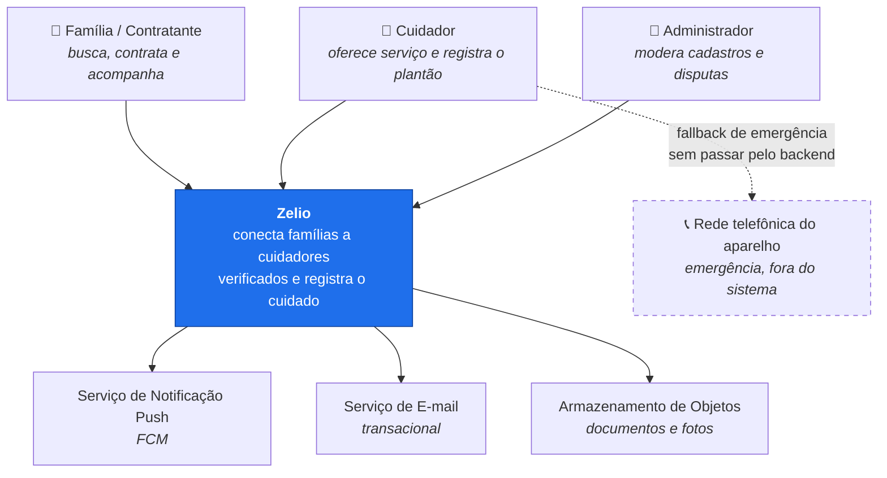
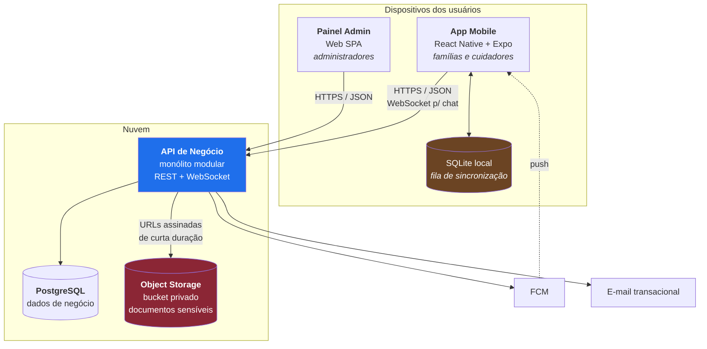
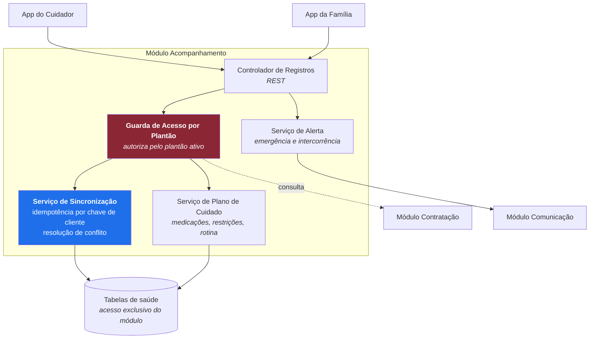
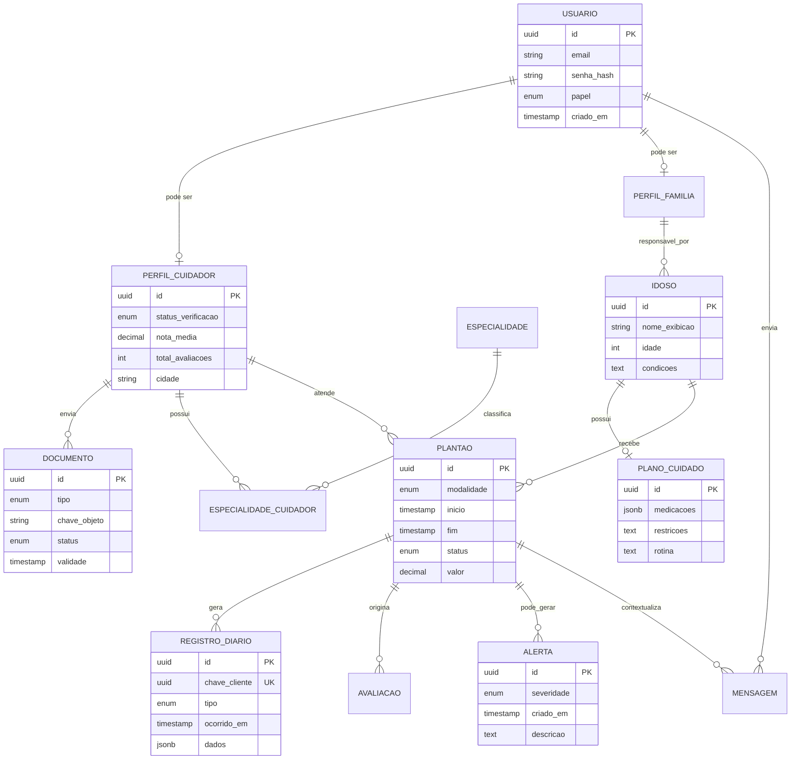
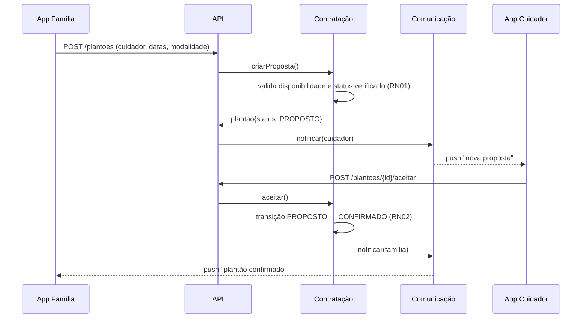
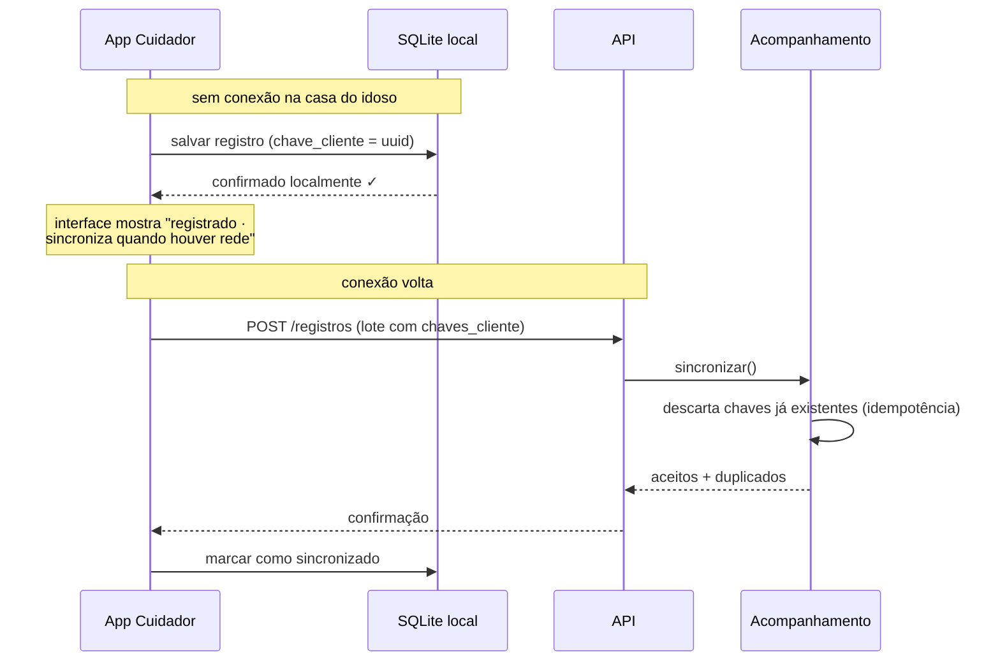
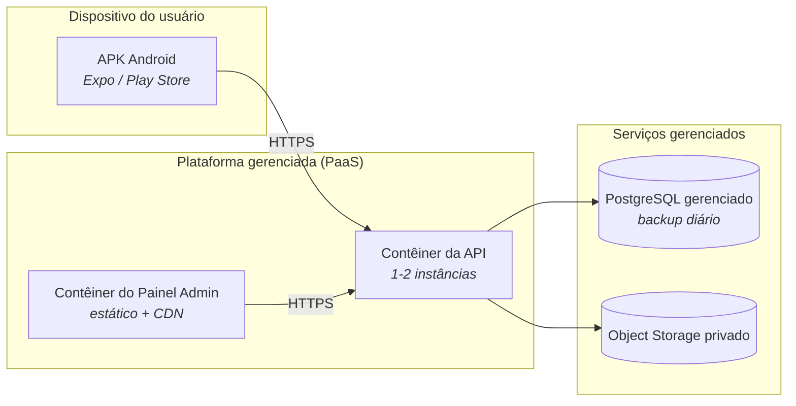

# Documento de Arquitetura de Software v1

## Zelio: App de Freelance de Cuidadores de Idosos

**Disciplina:** Projeto Integrado em Engenharia de Software III
**Professora:** Leonara Braz (2026.2, UFC Campus Quixadá)
**Versão:** 1.0
**Documentos relacionados:** `documento-requisitos-v1.md`, `roteiro-entrevistas-v1.md`

> **Status desta versão.** A arquitetura aqui descrita foi derivada do documento de requisitos v1, que ainda **não passou por validação com stakeholders reais**. As decisões marcadas com ⚠️ dependem de confirmação nas entrevistas e devem ser revisitadas na v2. Documentar essa dependência é parte da honestidade da arquitetura, não uma lacuna.

---

## 1. Introdução

### 1.1 Objetivo

Descrever a estrutura do sistema, as decisões arquiteturais tomadas, as alternativas descartadas e as razões de cada escolha, de forma que o MVP possa ser implementado e que um leitor externo consiga avaliar se a estrutura sustenta os requisitos.

### 1.2 Escopo

Cobre o MVP: aplicativo mobile para famílias e cuidadores, backend de negócio e painel administrativo web. Estão **fora do escopo desta versão**: pagamento intermediado pela plataforma, integração automatizada com bases de antecedentes criminais, versão iOS e versão web para o usuário final.

### 1.3 Público-alvo do documento

Desenvolvedor do projeto, professora da disciplina e avaliadores do projeto integrado.

> **Sobre a composição da equipe.** O projeto é desenvolvido por uma única pessoa, com autorização da professora. Isso não é um detalhe administrativo: é a restrição RES01, que molda boa parte das decisões deste documento.

---

## 2. Drivers arquiteturais

Arquitetura não é decidida por requisito funcional, porque funcionalidade quase sempre cabe em qualquer estrutura. O que molda a estrutura são atributos de qualidade, restrições e os poucos requisitos funcionais que são arquiteturalmente significativos.

### 2.1 Restrições (não negociáveis)

| ID | Restrição | Origem |
|---|---|---|
| RES01 | Um único desenvolvedor, um semestre, sem orçamento de infraestrutura | Contexto da disciplina |
| RES02 | Alvo Android, mínimo 2 GB de RAM | RNF05 |
| RES03 | Tratamento de dados pessoais sensíveis (documentos, saúde do idoso) sob a LGPD | RNF06 |
| RES04 | Interface utilizável por pessoas com baixa familiaridade digital | RNF01 |
| RES05 | Português do Brasil | RNF04 |

**RES01 é a restrição dominante.** Ela elimina, sozinha, arquiteturas distribuídas, múltiplos bancos de dados e qualquer coisa que exija operação contínua. Toda decisão deste documento é lida primeiro contra ela.

RES01 tem uma segunda consequência, menos óbvia e mais séria: **com um só desenvolvedor não existe revisão por pares**. Todo controle de qualidade que dependeria de uma segunda pessoa olhando o código precisa ser automatizado, ou simplesmente não acontece. Isso aparece nas consequências do ADR-01 e na mitigação do risco R03.

### 2.2 Requisitos funcionais arquiteturalmente significativos

Dos doze requisitos funcionais, apenas quatro alteram a estrutura do sistema:

| RF | Por que é significativo |
|---|---|
| **RF02**: upload de documentos comprobatórios | Introduz dado sensível e armazenamento de binários; exige segregação e controle de acesso próprios |
| **RF08**: painel de acompanhamento diário | É preenchido **na casa do idoso**, onde a conectividade é incerta; exige operação offline com sincronização |
| **RF09**: botão de emergência | Tem requisito de disponibilidade mais alto que o resto do sistema; não pode depender do backend |
| **RF04**: busca com filtros | Define o modelo de leitura e a estratégia de indexação |

Os demais (RF01, RF03, RF05, RF06, RF07, RF10, RF11, RF12) são CRUD, mensageria e notificação, e cabem na estrutura padrão sem influenciá-la.

### 2.3 Cenários de qualidade

Requisitos não funcionais escritos como frases ("deve ser seguro") não são verificáveis. Abaixo eles estão reescritos como cenários mensuráveis.

| ID | RNF | Cenário (estímulo → resposta → medida) |
|---|---|---|
| CQ01 | RNF03 | Uma família aplica filtros de especialidade e cidade sobre uma base de 5.000 cuidadores, em 4G. O sistema retorna a primeira página de resultados **em até 3 s no percentil 95** |
| CQ02 | RNF01 | Uma pessoa de 60 anos, sem experiência prévia com o app, consegue localizar e contratar um cuidador **em até 5 minutos, sem ajuda**, em teste de usabilidade com 5 participantes |
| CQ03 | RNF02 | Um atacante com acesso ao banco de dados obtém a tabela de documentos. Os arquivos **não são recuperáveis** sem a chave do serviço de armazenamento; nenhum documento é servido por URL pública permanente |
| CQ04 | RF08 | O cuidador registra medicação com o celular **sem conexão**. O registro é persistido localmente e sincronizado em até 60 s após a conexão voltar, **sem perda e sem duplicação** |
| CQ05 | RF09 | O cuidador aciona a emergência com o backend indisponível. O contato de emergência é alcançado **assim mesmo**, por canal nativo do aparelho |
| CQ06 | RNF05 | O app roda em aparelho Android com 2 GB de RAM. Tempo de abertura até a primeira tela útil **abaixo de 4 s** |
| CQ07 | RNF06 | O titular solicita exclusão dos dados. O sistema remove ou anonimiza os dados pessoais **em até 15 dias**, preservando o histórico financeiro exigido por lei de forma anonimizada |

---

## 3. Visão geral da arquitetura

### 3.1 Estilo escolhido

**Monólito modular** no backend, com **cliente mobile híbrido** e integração com serviços gerenciados para as capacidades que não são o núcleo do problema (armazenamento de arquivos, notificação push).

O backend é um único processo implantável, internamente dividido em módulos com fronteiras explícitas: cada módulo tem seu próprio conjunto de tabelas e expõe uma interface de serviço; módulos não acessam as tabelas uns dos outros diretamente. Isso preserva a possibilidade de extrair um módulo para serviço independente no futuro sem pagar hoje o custo operacional de sistemas distribuídos, custo que RES01 torna proibitivo.

### 3.2 Módulos do backend

| Módulo | Responsabilidade | RFs |
|---|---|---|
| **Identidade** | Cadastro, autenticação, sessão, perfis | RF01, RF03 |
| **Verificação** | Upload de documentos, fila de moderação, decisão do administrador | RF02, RF11, RN01 |
| **Catálogo** | Perfis públicos de cuidadores, busca e filtros | RF04 |
| **Contratação** | Plantões: proposta, aceite, agenda, cancelamento, histórico | RF06, RF10, RF12, RN02 |
| **Acompanhamento** | Registros diários, plano de cuidado, alerta de emergência | RF08, RF09 |
| **Reputação** | Avaliações mútuas e nota agregada | RF07, RN03, RN04 |
| **Comunicação** | Chat, notificações push, e-mail transacional | RF05, RF10 |

A fronteira mais importante é entre **Acompanhamento** e todo o resto: é o módulo que guarda dados de saúde. Ele é o único com acesso a essas tabelas e aplica sozinho a regra de acesso por plantão ativo (Seção 7.2).

---

## 4. Visão de contexto (C4 nível 1)

A linha tracejada para a rede telefônica é intencional e é a decisão mais importante do diagrama: a emergência (RF09) **não depende do sistema estar no ar** (ver ADR-06).

---

## 5. Visão de contêineres (C4 nível 2)

| Contêiner | Tecnologia | Responsabilidade |
|---|---|---|
| App Mobile | React Native + Expo (TypeScript) | Interface de família e cuidador; cache e fila offline |
| SQLite local | SQLite via Expo | Persistência dos registros do painel enquanto sem conexão (CQ04) |
| Painel Admin | SPA web (React) | Fila de moderação, disputas, métricas: separado por ter público, frequência de uso e requisitos de segurança distintos |
| API de Negócio | Node.js + NestJS (TypeScript) | Regras de negócio, autorização, orquestração |
| PostgreSQL | PostgreSQL 16+ | Dados relacionais de negócio |
| Object Storage | S3-compatível, bucket privado | Documentos, certificados e fotos: nunca públicos |

---

## 6. Visão de componentes do módulo Acompanhamento (C4 nível 3)

Detalhado por ser o módulo que concentra o diferencial do produto (RF08) e o dado mais sensível.

**Guarda de Acesso por Plantão** é o componente de segurança central: nenhum acesso a dado de saúde é autorizado por identidade apenas ("é cuidador"), mas por **relação ativa** ("é o cuidador deste plantão, e o plantão está em andamento"). Quando o plantão termina, o acesso do cuidador ao plano de cuidado se encerra.

---

## 7. Dados

### 7.1 Modelo conceitual

### 7.2 Classificação e segregação de dados

| Classe | Exemplos | Onde vive | Regra de acesso |
|---|---|---|---|
| **Público** | Nome do cuidador, especialidades, nota, cidade | PostgreSQL | Qualquer usuário autenticado |
| **Restrito** | Contato, endereço, valores de plantão | PostgreSQL | Partes do plantão confirmado |
| **Sensível: documental** | Antecedentes, certificados, RG | Object storage privado (criptografia em repouso); só a chave no banco | Administrador, durante moderação |
| **Sensível: saúde** | Condições do idoso, plano de cuidado, registros diários | Tabelas exclusivas do módulo Acompanhamento | Família responsável, sempre; cuidador **apenas durante plantão ativo** |

O campo `REGISTRO_DIARIO.chave_cliente` é gerado no dispositivo e garante idempotência: se o app reenviar um registro por instabilidade de rede, o servidor reconhece a repetição e não duplica (CQ04).

### 7.3 Base legal sob a LGPD ⚠️

Dado de saúde é dado pessoal sensível (art. 5º, II) e seu tratamento exige uma das hipóteses do art. 11. A hipótese de **"tutela da saúde"** vale para tratamento realizado por profissionais de saúde, serviços de saúde ou autoridade sanitária. A plataforma **não se enquadra** nessas categorias, por ser intermediadora entre particulares.

A base legal adotada é, portanto, o **consentimento específico e destacado** do titular (art. 11, I), coletado do idoso ou de seu representante legal, separado dos termos de uso, com finalidade explícita e revogável. Consequências arquiteturais: registro auditável de consentimento por finalidade, mecanismo de revogação e rotina de eliminação/anonimização (CQ07).

*⚠️ Ponto a confirmar com fonte jurídica e, se possível, na entrevista de perfil C (pergunta C3).*

---

## 8. Cenários de execução

### 8.1 Contratar um plantão (RF06, RN02)

### 8.2 Registro do painel sem conexão (RF08, CQ04)

A interface **confirma o registro localmente antes de sincronizar**. O cuidador nunca depende da rede para concluir a tarefa. Se dependesse, a fricção do RF08 aumentaria justamente onde a hipótese H5 já é frágil.

---

## 9. Decisões arquiteturais (ADRs)

### ADR-01: Monólito modular em vez de microsserviços

**Contexto.** Um único desenvolvedor, um semestre, sem orçamento nem experiência operacional (RES01).
**Decisão.** Decidi por um único serviço implantável, dividido em módulos com fronteiras de dados explícitas.
**Alternativa descartada.** Microsserviços por domínio, que trazem descoberta de serviço, rastreamento distribuído, consistência eventual e múltiplos pipelines. O custo é pago desde o primeiro dia e o benefício (escala independente) não existe no MVP.
**Consequências.** Deploy e depuração simples. Em contrapartida, a disciplina de fronteira não é imposta pelo runtime, e sem revisor humano (RES01) ela também não pode depender de revisão de código: precisa de teste automatizado que falhe o build ao detectar acesso cruzado a tabelas. Se essa verificação não existir, o monólito vira emaranhado (risco R03).

### ADR-02: React Native + Expo para o app

**Contexto.** Alvo Android com 2 GB de RAM (RES02), um só desenvolvedor, prazo curto, protótipo de alta fidelidade a ser validado com stakeholder.
**Decisão.** Decidi usar React Native com Expo, em TypeScript.
**Alternativas.** *Flutter*: desempenho e consistência visual excelentes, mas exigiria Dart, uma linguagem a mais para aprender, e não compartilha código com o painel admin. *Android nativo (Kotlin)*: melhor desempenho, porém sem reaproveitamento algum e com curva maior. *PWA*: descartada, porque notificação push confiável e acesso a recursos nativos são fracos no Android, e RF09 depende de discagem nativa.
**Justificativa.** TypeScript unifica app, painel admin e backend, o que para um desenvolvedor sozinho vale mais que os ganhos marginais de desempenho do Flutter para um app majoritariamente de formulários e listas. Expo encurta radicalmente o ciclo de build e distribuição de versões de teste, o que é relevante para validar o protótipo com stakeholders reais dentro do semestre.
**Consequências.** Atenção a peso do bundle e uso de memória por causa do RNF05 (CQ06); telas de lista precisam de virtualização.

### ADR-03: Backend próprio em vez de BaaS

**Contexto.** Um BaaS (Firebase, Supabase) entregaria autenticação, banco e storage prontos, economizando semanas.
**Decisão.** Decidi construir backend próprio (NestJS + PostgreSQL), usando serviços gerenciados apenas para armazenamento de objetos, push e e-mail.
**Justificativa.** Duas razões. (1) **Acadêmica:** a disciplina avalia projeto e implementação de arquitetura; terceirizar a camada de negócio esvaziaria o objeto de avaliação. (2) **Técnica:** as regras de acesso a dado de saúde (Seção 6) são condicionais a estado de negócio ("durante plantão ativo"), e expressá-las em regras declarativas de BaaS é frágil e difícil de testar; em código de aplicação são explícitas e cobertas por testes.
**Consequências.** Mais trabalho de infraestrutura e autenticação. Mitigado com biblioteca madura de auth e deploy em plataforma gerenciada (Seção 10).

### ADR-04: Documentos sensíveis fora do banco, em bucket privado com URL assinada

**Contexto.** RF02 exige upload de antecedentes criminais e certificados; RNF02 e CQ03 exigem proteção.
**Decisão.** Decidi manter os binários em bucket privado com criptografia em repouso. O banco guarda apenas a chave do objeto e os metadados. Todo acesso é feito por **URL assinada com validade de minutos**, gerada sob autorização da aplicação.
**Alternativas.** *BLOB no PostgreSQL*: infla o banco, complica backup e não separa a classe de dado. *Bucket público com nome aleatório*: segurança por obscuridade; uma URL vazada expõe o documento para sempre.
**Consequências.** Nenhuma URL permanente de documento existe. Exige rotina de expiração e política de retenção alinhada ao CQ07.

### ADR-05: Offline-first no painel de acompanhamento

**Contexto.** RF08 é preenchido na casa do idoso, onde a conexão é incerta (a ser quantificado pela pergunta B15).
**Decisão.** Decidi por escrita local primeiro em SQLite, com fila de sincronização e idempotência por chave gerada no cliente.
**Alternativa descartada.** Exigir conexão para registrar. Isso transformaria falha de rede em perda de registro de medicação, inaceitável para o domínio, e aumentaria o atrito do cuidador exatamente no ponto mais frágil do produto (hipótese H5).
**Consequências.** Complexidade de sincronização e necessidade de política de conflito. Mitigação: registros são **append-only** e imutáveis após criação; correção gera novo registro que referencia o anterior. Sem edição concorrente, não há conflito real a resolver.

### ADR-06: Emergência independente do backend

**Contexto.** RF09 e CQ05. Um botão de emergência que falha junto com o servidor é pior que não ter botão, porque cria falsa confiança.
**Decisão.** Decidi que o acionamento dispara **em paralelo**: (a) discagem nativa e SMS para o contato de emergência cadastrado, direto do aparelho, sem passar pelo backend; (b) notificação push e registro de alerta via API, em regime de melhor esforço.
**Consequências.** O caminho crítico depende só do aparelho e da rede telefônica. O contato de emergência precisa estar em cache local no dispositivo, sincronizado no início de cada plantão.

### ADR-07: Verificação de antecedentes manual no MVP

**Contexto.** RF02, RF11 e RN01 dependem de verificar documentos. Integração automatizada com bases oficiais tem custo, contrato e complexidade legal.
**Decisão.** Decidi manter, no MVP, a análise manual do administrador pela fila de moderação do painel web. A arquitetura isola essa etapa atrás da interface do módulo Verificação.
**Consequências.** O processo não escala, mas não precisa escalar no MVP, e a fronteira do módulo permite substituir o passo manual por integração externa sem tocar no resto do sistema.

### ADR-08: Busca por cidade/bairro, não por raio geográfico

**Contexto.** RF04 e CQ01.
**Decisão.** Decidi filtrar por cidade e bairro, com índices B-tree compostos em PostgreSQL. Sem PostGIS, sem cálculo de distância.
**Justificativa.** Cuidado domiciliar é contratado por região administrativa, não por distância em quilômetros; e o volume do MVP não justifica índice espacial.
**Consequências.** Reavaliar se as entrevistas indicarem que famílias raciocinam em termos de deslocamento ("perto do bairro X") em vez de bairro exato.

---

## 10. Visão de implantação

**Ambientes:** desenvolvimento local (Docker Compose), homologação (usada nas validações com stakeholder) e produção. Pipeline de CI executando lint, testes unitários, testes de integração dos módulos e a verificação de fronteiras do R03 a cada push.

---

## 11. Táticas por atributo de qualidade

| Atributo | Cenário | Tática arquitetural | Como verificar |
|---|---|---|---|
| Desempenho | CQ01 | Índices compostos (`cidade`, `especialidade`, `status`); paginação por cursor; projeção enxuta no perfil de listagem | Teste de carga com base sintética de 5.000 perfis |
| Usabilidade | CQ02 | Fluxos separados por papel desde o login; vocabulário do domínio, não do sistema; alvos de toque grandes; nenhuma etapa obrigatória de mais de 3 campos | Teste de usabilidade com 5 participantes do perfil-alvo |
| Segurança | CQ03 | Bucket privado + URL assinada de curta duração (ADR-04); criptografia em repouso; princípio do menor privilégio | Tentativa de acesso direto ao objeto sem assinatura; revisão de permissões |
| Confiabilidade | CQ04 | Escrita local primeiro; fila de sincronização; idempotência por chave de cliente; registros imutáveis (ADR-05) | Teste com modo avião e reenvio forçado do mesmo lote |
| Disponibilidade | CQ05 | Caminho de emergência independente do backend (ADR-06); contato em cache local | Teste com API derrubada |
| Eficiência de recursos | CQ06 | Listas virtualizadas; imagens redimensionadas no servidor; sem bibliotecas pesadas de UI | Medição em aparelho físico de 2 GB |
| Conformidade | CQ07 | Consentimento registrado por finalidade; segregação por classe de dado; rotina de eliminação/anonimização | Executar solicitação de exclusão em homologação e auditar resíduos |

---

## 12. Rastreabilidade requisito → módulo

| RF | Módulo responsável | Contêiner |
|---|---|---|
| RF01, RF03 | Identidade | API + PostgreSQL |
| RF02, RF11 | Verificação | API + Object Storage + Painel Admin |
| RF04 | Catálogo | API + PostgreSQL |
| RF05 | Comunicação | API (WebSocket) |
| RF06, RF10, RF12 | Contratação | API + PostgreSQL |
| RF07 | Reputação | API + PostgreSQL |
| RF08 | Acompanhamento | App (SQLite) + API |
| RF09 | Acompanhamento + recurso nativo | App (nativo) + API |

---

## 13. Riscos e dívidas técnicas assumidas

| ID | Risco | Impacto | Mitigação |
|---|---|---|---|
| R01 | H5 se mostrar falsa: cuidadores rejeitam o registro diário | **Alto**: derruba o diferencial central e boa parte do módulo Acompanhamento | Priorizar as perguntas B11-B14 nas entrevistas; ter plano B (registro por seleção rápida ou áudio, sem digitação) |
| R02 | Base legal do dado de saúde estar mal enquadrada | Alto: risco de conformidade | Validar com fonte jurídica antes da v2 (Seção 7.3) |
| R03 | Fronteiras entre módulos erodirem com a pressa do semestre | Médio: o monólito modular vira monólito e só | Teste automatizado de dependência entre módulos rodando no CI, falhando o build em acesso cruzado a tabelas. Sem revisor humano (RES01), a verificação **precisa** ser automática |
| R04 | Verificação manual (ADR-07) travar por indisponibilidade do desenvolvedor | Médio: cuidadores não entram no catálogo | SLA interno de 48h e indicador de fila no painel admin |
| R05 | Chat próprio consumir tempo desproporcional | Médio | Escopo mínimo: texto puro, sem mídia, sem indicador de digitação. Se atrasar, cortar para v2 |
| R07 | Nome **Zelio** é foneticamente muito próximo do concorrente **Zelo** (webapp do mesmo nicho) | Médio: confusão de marca e risco de conflito de registro | Consultar busca no INPI antes de investir em identidade visual; considerar assinatura que diferencie (ex.: "Zelio Cuidados") |
| R06 | Base de cuidadores vazia no lançamento (problema do ovo e da galinha) | Alto para o produto, não para a arquitetura | Fora do escopo técnico: tratar na estratégia de validação regional |

---

## 14. Pendências para a v2

1. Revisar drivers e ADRs à luz dos resultados das entrevistas, especialmente ADR-05 e ADR-08.
2. Fechar a base legal do tratamento de dados de saúde (⚠️ Seção 7.3).
3. Detalhar o modelo de estados do plantão (máquina de estados completa com transições e regras).
4. Definir o modelo de negócio e seu impacto arquitetural (se houver pagamento intermediado, entra requisito de PCI e um módulo Financeiro).
5. Especificar o contrato da API (OpenAPI) dos módulos Contratação e Acompanhamento.
